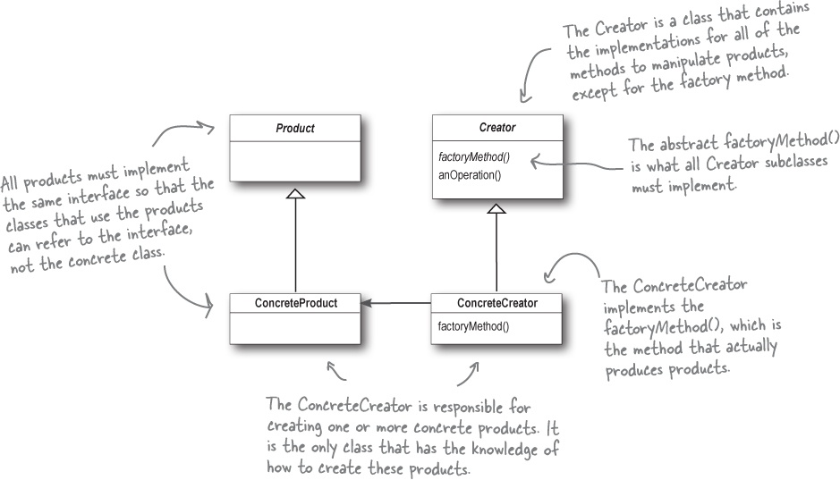
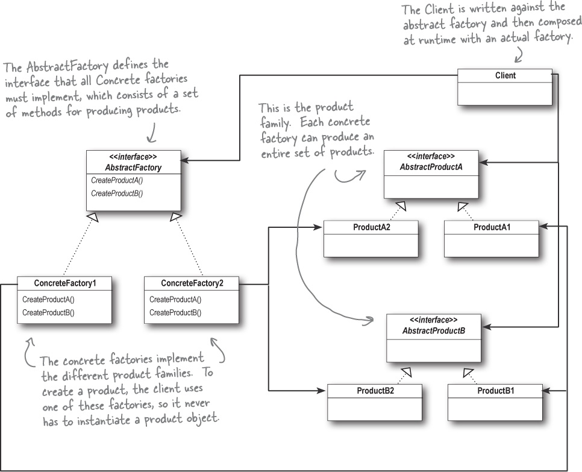
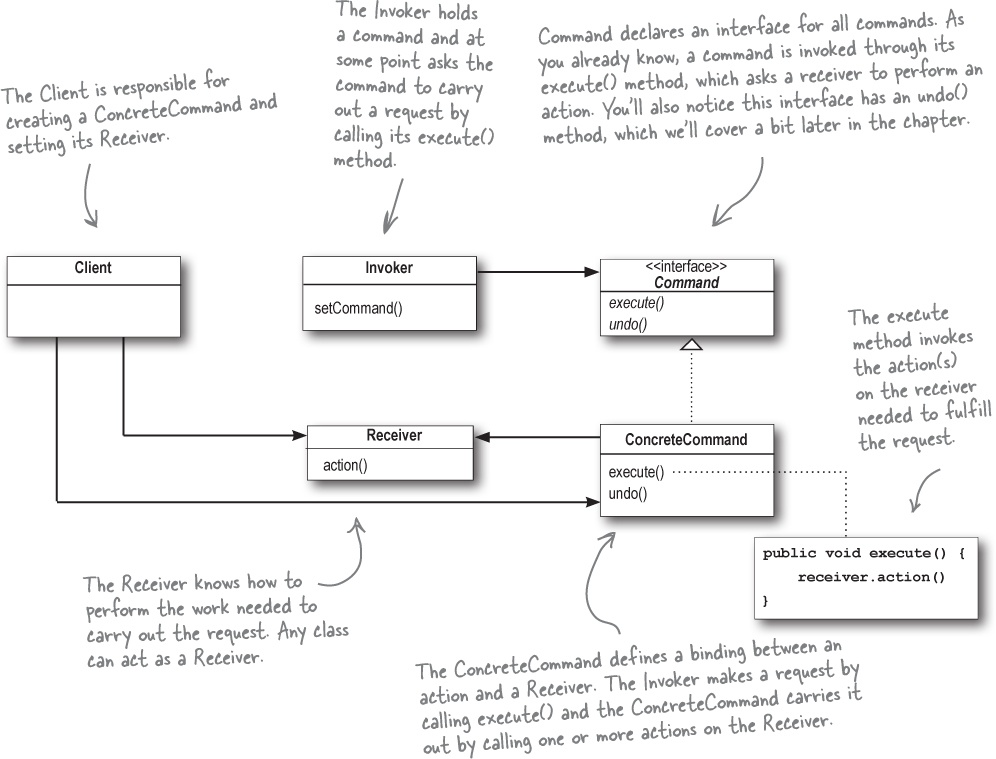

# 设计模式 Design Pattern

## 设计原则 Design Principle

1. 单一职责原则 \(Single Responsibility Principle, SRP\)
2. 开闭原则 \(Open-Closed Principle, OCP\)
3. 里氏代换原则 \(Liskov Substitution Principle, LSP\)
4. 依赖倒转原则 \(Dependency Inversion Principle, DIP\)
5. 接口隔离原则 \(Interface Segregation Principle, ISP\)
6. 迪米特法则 \(Law of Demeter, LoD\)

## 创建型模式

### 工厂模式 Factory Method Pattern

The Factory Method Pattern defines an interface for creating an object, but lets subclasses decide which class to instantiate. Factory Method lets a class defer instantiation to subclasses.

### 抽象工厂模式 Abstract Factory Pattern

The Abstract Factory Pattern provides an interface for creating families of related or dependent objects without specifying their concrete classes.

## 结构型模式

## 行为型模式

### 命令模式 Command Pattern

Command模式将一个请求封装为一个对象，从而允许您用不同的请求、队列或日志请求来参数化其他对象，并支持可撤销的操作。 The Command Pattern encapsulates a request as an object, thereby letting you parameterize other objects with different requests, queue or log requests, and support undoable operations.

对于细小琐碎的具体命令，在Java 8中可以用Lambada表达式快速传入到Invoker中

