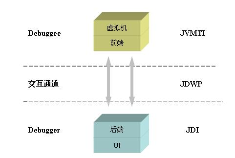

# Java Debug

## [JPDA](http://www.ibm.com/developerworks/cn/java/j-lo-jpda1/index.html?ca=drs-)

### Java调试体系

JVMPI \(JavaVirtual Machine Profiler Interface\)

JVMDI \(Java Virtual Machine Debug Interface\)

JVMTI \(Java Virtual Machine Tool Interface\)

### JPDA 组成模块



```text
Debugger->Debuggee: send command
Note right of Debuggee: JDWP
Debuggee-->Debugger: send result
```

#### Java虚拟机工具接口 \(JVMTI\)

JVMTI（Java Virtual Machine Tool Interface）即指 Java 虚拟机工具接口，它是一套由虚拟机直接提供的 native 接口，它处于整个 JPDA 体系的最底层，所有调试功能本质上都需要通过 JVMTI 来提供。 JVMTI 的前身是 JVMDI 和 JVMPI，它们原来分别被用于提供调试 Java 程序以及 Java 程序调节性能的功能。

#### Java调试线协议 \(JDWP\)

JDWP（Java Debug Wire Protocol）是一个为 Java 调试而设计的一个通讯交互协议，它定义了调试器和被调试程序之间传递的信息的格式。 Sun 公司提供的实现中，它提供了一个名为 jdwp.dll（jdwp.so）的动态链接库文件，这个动态库文件实现了一个 Agent，它会负责解析前端发出的请求或者命令，并将其转化为 JVMTI 调用，然后将 JVMTI 函数的返回值封装成 JDWP 数据发还给后端。

#### Java调试接口 \(JDI\)

JDI（Java Debug Interface）是三个模块中最高层的接口，在多数的 JDK 中，它是由 Java 语言实现的。 JDI 由针对前端定义的接口组成，通过它，调试工具开发人员就能通过前端虚拟机上的调试器来远程操控后端虚拟机上被调试程序的运行，从理论上说，开发人员只需使用 JDWP 和 JVMTI 即可支持跨平台的远程调试，但是直接编写 JDWP 程序费时费力，而且效率不高。因此基于 Java 的 JDI 层的引入，简化了操作，提高了开发人员开发调试程序的效率。

| 模块 | 层次 | 编程语言 | 作用 |
| :--- | :--- | :--- | :--- |
| JVMTI | 底层 | C | 获取及控制当前虚拟机状态 |
| JDWP | 中介层 | C | 定义 JVMTI 和 JDI 交互的数据格式 |
| JDI | 高层 | Java | 提供 Java API 来远程控制被调试虚拟机 |
|  |  |  |  |

### JPDA 实现

每一个虚拟机都应该实现 JVMTI 接口，但是 JDWP 和 JDI 本身与虚拟机并非是不可分的，这三个层之间是通过标准所定义的交互的接口和协议联系起来的，因此它们可以被独立替换或取代，但不会影响到整体调试工具的开发和使用。因此，开发和使用自己的 JDWP 和 JDI 接口实现是可能的。

### Java 调试接口的特点

从构架上说，我们可以把 JPDA 看作成是一个 C/S 体系结构的应用，在这个构架下，我们可以方便地通过网络，在任意的地点调试另外一个虚拟机上的程序，这个就很好地解决了部署和测试的问题，尤其满足解决了很多网络时代中的开发应用的需求。前端和后端的分离，也方便用户开发适合于自己的调试工具。

从效率上看，由于 Java 程序本身就是编译成字节码，运行在虚拟机上的，因此调试前后的程序、内存占用都不会有大变化（仅仅是启动一个 JDWP 所需要的内存），任意程度都可以很好地调试，非常方便。而 JPDA 构架下的几个组成部分，JDWP 和 JDI 都比较小，主要的工作可以让虚拟机自己完成。

从灵活性上，Java 调试工具是建立在强大的虚拟机上的，因此，很多前沿的应用，比如动态编译运行，字节码的实时替换等等，都可以通过对虚拟机的改进而得到实现。随着虚拟机技术的逐步发展和深入，各种不同种类，不同应用领域中虚拟机的出现，各种强大的功能的加入，给我们的调试工具也带来很多新的应用。

## [JVMTI 和 Agent 实现](https://www.ibm.com/developerworks/cn/java/j-lo-jpda2/index.htm)

### JVMTI的简介

JVMTI 是一套本地代码接口，因此使用 JVMTI 需要我们与 C/C++ 以及 JNI 打交道。事实上，开发时一般采用建立一个 Agent 的方式来使用 JVMTI，它使用 JVMTI 函数，设置一些回调函数，并从 Java 虚拟机中得到当前的运行态信息，并作出自己的判断，最后还可能操作虚拟机的运行态。把 Agent 编译成一个动态链接库之后，我们就可以在 Java 程序启动的时候来加载它（启动加载模式），也可以在 Java 5 之后使用运行时加载（活动加载模式）。

* -agentlib:agent-lib-name=options
* -agentpath:path-to-agent=options

### Agent 的工作过程

#### 启动

Agent 是在 Java 虚拟机启动之时加载的，这个加载处于虚拟机初始化的早期，在这个时间点上：

* 所有的 Java 类都未被初始化；
* 所有的对象实例都未被创建；
* 因而，没有任何 Java 代码被执行；

动态库被加载之后，虚拟机会先寻找一个 Agent 入口函数：

#### 卸载

最后，Agent 完成任务，或者虚拟机关闭的时候，虚拟机都会调用一个类似于类析构函数的方法来完成最后的清理任务

### JVMTI 基本功能

* 事件处理和回调函数
* 内存控制和对象获取
* 线程和锁​
* 调试功能

