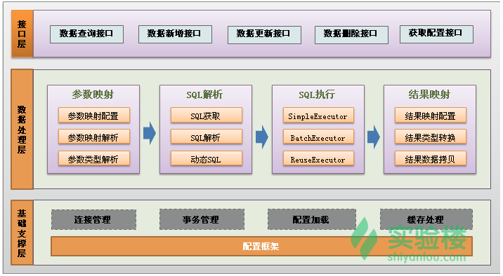
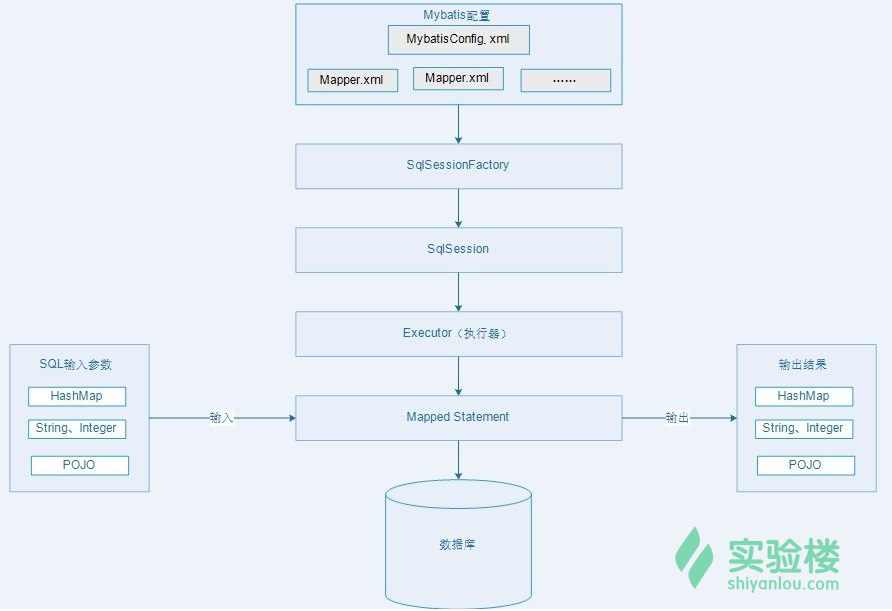

# MyBatis

## 什么是MyBatis

ORM（Object/Relational Mapping），即对象关系映射，它完成面向对象的编程语言到关系数据库的映射。ORM 工具的唯一作用是：把持久化对象的保存、修改、删除等操作，转换成对数据库的操作。

ORM 基本映射关系：

- 数据表映射类
- 数据表的行映射对象（实例）
- 数据表的列（字段）映射对象的属性

MyBatis 本是 apache 的一个开源项目 iBatis , 2010年这个项目由 apache software foundation 迁移到了 google code，并且改名为 MyBatis 。

MyBatis 是支持定制化 SQL、存储过程以及高级映射的优秀的持久层框架。MyBatis 避免了几乎所有的 JDBC 代码和手动设置参数以及对结果集的检索封装。`MyBatis 可以对配置和原生 Map 使用简单的 XML 或注解，将接口和 Java 的 POJO(Plain Old Java Objects,普通的 Java 对象)映射成数据库中的记录。`

MyBatis 的主要思想是将程序中的大量 SQL 语句抽取出来，配置在配置文件中，以实现 SQL 的灵活配置。

MyBatis 并不完全是一种 ORM 框架，它的设计思想和 ORM 相似，只是它允许直接编写 SQL 语句，使得数据库访问更加灵活。因此，准确地说，MyBatis 提供了一种“半自动化”的 ORM 实现，是一种 "SQL Mapping" 框架。

## 功能架构

- **API接口层**：提供给外部使用的接口 API，开发人员通过这些本地 API 来操纵数据库。接口层一接收到调用请求就会调用数据处理层来完成具体的数据处理。
- **数据处理层**：负责具体的 SQL 查找、SQL 解析、SQL 执行和执行结果映射处理等。它主要的目的是根据调用的请求完成一次数据库操作。
- **基础支撑层**：负责最基础的功能支撑，包括连接管理、事务管理、配置加载和缓存处理，这些都是共用的东西，将他们抽取出来作为最基础的组件，为上层的数据处理层提供最基础的支撑。

## 框架架构

- **加载配置**：MyBatis 应用程序根据XML配置文件加载运行环境，创建 SqlSessionFactory，SqlSessionFactory，配置来源于两个地方，一处是配置文件，一处是 Java 代码的注解，将 SQL 的配置信息加载成为一个个 MappedStatement 对象（包括了传入参数映射配置、执行的SQL语句、结果映射配置），存储在内存中。
- **SQL 解析**：当 API 接口层接收到调用请求时，会接收到传入 SQL 的 ID 和传入对象（可以是 Map、JavaBean 或者基本数据类型），Mybatis 会根据 SQL 的 ID 找到对应的 MappedStatement，然后根据传入参数对象对 MappedStatement 进行解析，解析后可以得到最终要执行的 SQL 语句和参数。
- **SQL 执行**：SqlSession 将最终得到的 SQL 和参数拿到数据库进行执行，得到操作数据库的结果。
- **结果映射**：将操作数据库的结果按照映射的配置进行转换，可以转换成 HashMap、JavaBean 或者基本数据类型，并将最终结果返回，用完之后关闭 SqlSession。

## MyBatis 的优点

1. 简单小巧易于上手，方便浏览修改 SQL 语句
2. 解除 SQL 与程序代码的耦合
3. 提供映射标签，支持对象与数据库的 ORM 字段关系映射
4. 提供 xml 标签，支持编写动态 SQL