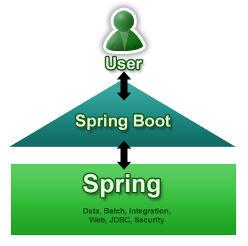

# Mastering Spring Boot 2.0

Mastering Spring Boot 2.0 By: Dinesh Rajput Publisher: Packt Publishing Pub. Date: May 31, 2018 Print ISBN-13: 978-1-78712-756-2 Web ISBN-13: 978-1-78712-514-8 Pages in Print Edition: 390

## Getting Started with Spring Boot 2.0

### Introducing Spring Boot

Spring Boot makes it easy to create stand-alone, production-grade Spring based Applications that you can "just run."

Spring Boot provides a new strategy for application development with the Spring Framework, with minimal fuss. It enables you to focus only on the application's functionality rather than Spring metaconfiguration. Spring Boot requires either minimal or zero configuration in the Spring application.

### Simplifying Spring application development using Spring Boot



### The essential key components of Spring Boot

The following are essential key components of Spring Boot:

* Spring Boot Starters
* Automatic configuration
* Spring Boot CLI
* Spring Boot Actuator

### Setting up a Spring Boot workspace

* Java SDK v1.8 or higher
* Spring Framework 5.0.0.RELEASE or above
* Maven \(3.2+\) and Gradle 4
* Tomcat 8.5, that is, a Servlet 3.0+ compatible container

#### Set up Spring Boot with Maven

create minimum pom.xml file:

```markup
<?xml version="1.0" encoding="UTF-8"?>
<project xmlns="http://maven.apache.org/POM/4.0.0" xmlns:xsi="http://www.w3.org/2001/XMLSchema-instance"
   xsi:schemaLocation="http://maven.apache.org/POM/4.0.0 http://maven.apache.org/xsd/maven-4.0.0.xsd">
   <modelVersion>4.0.0</modelVersion>
   <parent>        
           <groupId>org.springframework.boot</groupId>        
           <artifactId>spring-boot-starter-parent</artifactId>   
        <version>2.0.2.RELEASE</version>        
           <relativePath/> <!-- lookup parent from repository -->   
   </parent>

   <dependencies>
    <dependency>                             
        <groupId>org.springframework.boot</groupId>                      
        <artifactId>spring-boot-starter-web</artifactId>    
    </dependency>

   </dependencies>
   ...
   ...
</project>
```

### Developing your first Spring Boot application

Use Spring Boot Initializr \(web application that can create a Spring Boot project strcuture for you\).

* Spring Boot Initializr through a web-based interface \([https://start.spring.io](https://start.spring.io)\)
* You can also use it through an IDE such as Spring Tool Suite \(STS\) and IntelliJ IDEA
* Using the Spring Boot CLI

#### Using a web interface for Spring Initializr

Go web site [https://start.spring.io](https://start.spring.io)

#### Implementing the REST service

```java
@RestController
public class HelloController {
    @GetMapping("/hello")
    String sayHello() {
        return "Hello World";
    }
}
```

Run the class "Application" with main method.

### Customizing Auto-Configuration in Spring Boot Application

#### Using Spring Boot properties

application.properties

### Getting Started with Spring CLI and Actuator

Spring Boot privodes two interface: 1. ApplicationRunner 2.CommandLineRunner

#### Installing the Spring Boot CLI

Go through [https://docs.spring.io/spring-boot/docs/current/reference/html/getting-started-installing-spring-boot.html](https://docs.spring.io/spring-boot/docs/current/reference/html/getting-started-installing-spring-boot.html)

#### Using the Initializr with the Spring Boot CLI

Spring CLI build project

```text
spring init
spring init -dweb, jpa 
spring init -dweb,jpa --build gradle -p war
```

### Spring Boot Actuator – taking Application's Insights

The Spring Boot Actuator allows you to monitor production-ready features, such as metrics and the health of the Spring application.

#### Enabling Spring Boot's Actuator in your application

add dependency in pom.xml

```markup
<dependencies>
   <dependency>
         <groupId>org.springframework.boot</groupId>
         <artifactId>spring-boot-starter-actuator</artifactId>
   </dependency>
</dependencies>
```

#### Analyzing the Actuator's endpoints

Spring Boot's Actuator offers you several web endpoints, support the following details:

* Bean details
* Logger details
* Configuration details
* Health details
* Version details

| **REST endpoints** | **Description** |
| :--- | :--- |
| /actuator | It gives a discovery platform in place of a page for other endpoints. To enable Actuator, you have to put Spring HATEOS on the classpath. Actuators are sensitive by default and hence require username and password, or they can be disabled due to disabled web security. |
| /auditevents | All information on audit and events is contained in this endpoint. |
| /autoconfig | It provides an auto-configuration report of all the auto-configurations applied in the application. |
| /beans | It shows all the beans configured in the application. Beans are super important for applications configured in Spring. It is an object that is initialized, assembled, and managed in Spring IoC container. |
| /configprops | It shows you the details of config properties. |
| /dump | This is for dumping a thread. |
| /env | It shows different properties of all configurable environments in Spring. |
| /flyway | This helps when you want to see database migrations. |
| /health | This displays the health information of an application. Health information includes security, authentication of connections made, and message details of authentications for an application. |
| /info | This is the arbitrary application information. |
| /loggers | You can use it if you want to show or change the config of different loggers in your application. |
| /liquibase | This is in case you want to see migrations of liquibase. |
| /metrics | This shows metric information for an application. |
| /mappings | This shows a queue of the entire request mapping paths in the application. |
| /shutdown | It is enabled to allow the application a graceful shutdown. Spring Boot Actuator does not enable it by default. You will have to enable it should you require it. |
| /trace | Shows trace data \(timestamp, headers, and so on\) which is the 100 latest HTTP requests. |

